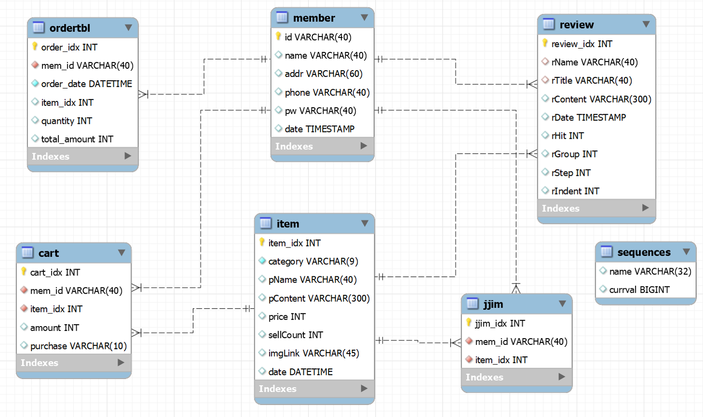

<h2>🌱Campers🌱</h2>
캠핑용품 전문 온라인 쇼핑몰
<!-- 
 -->

<h3 style="padding:10px; border-bottom: 1px solid rgb(195, 193, 193);">👏Description</h3>
<!-- 
 -->
캠핑용품 전문 온라인 쇼핑몰 1인 프로젝트입니다. MySQL, JSP 를 이용해 CRUD 기능을 구현하여 배운 내용들을 복습하고 응용하여 웹개발 능력을 키우는 것을 목표로 했습니다.

<h3 style="padding:10px; border-bottom: 1px solid rgb(195, 193, 193);">👟Features</h3>
<!-- 
 -->
  <h4 style="color:gray; margin-left: 12px;">로그인</h4>
    <ul>
      <li>메인페이지 서비스 이용 시도 시 로그인 페이지로 이동</li>
      <li>유저가 비로그인 시 마이페이지 안보이게 설정</li>
      <li>로그인 시 userId, userPw가 일치하는지 체크</li>
      <li>input에 userId, userPw 정보가 다 들어왔는지 확인</li>
      <li>로그인 정보 분실 시, id,pw 찾기</li>
    </ul>

  <h4 style="color:gray; margin-left: 12px;">회원가입</h4>
    <ul>
      <li>아이디 중복 체크</li>
      <li>input에 정보가 다 들어왔는지 확인하고 회원가입 승인</li>
    </ul>
  <h4 style="color:gray; margin-left: 12px;">제품리스트</h4>
    <ul>
      <li>카테고리별 제품조회</li>
      <li>조건별(신상품순, 판매순, 가격순 등) 제품조회</li>
      <!-- <li>페이지네이션 추가</li> -->
    </ul>
  <h4 style="color:gray; margin-left: 12px;">제품상세페이지</h4>
    <ul>
      <li>장바구니 담기</li>
      <li>찜하기, 이미 찜한 상품은 찜하기 취소</li>
      <li>바로 구매하기 기능(카카오 API)</li>
    </ul>
  <h4 style="color:gray; margin-left: 12px;">리뷰게시판</h4>
    <ul>
      <li>회원 아이디 표시</li>
      <li>리뷰글 작성 기능(300자 이내)</li>
      <li>작성자에 한해서 해당 게시글 수정 혹은 삭제 가능</li>
      <li>등록된 리뷰 답글 기능</li>
    </ul>
  <h4 style="color:gray; margin-left: 12px;">마이페이지</h4>
    <ul>
      <li>계정 정보 변경 기능 및 메뉴 추가(nickname, email, password)</li>
      <li>내 찜한상품, 장바구니 담은 상품, 작성한 리뷰 모아보기 설정</li>
      <li>내가 쓴 게시글 삭제 기능 추가</li>
      <li>회원탈퇴 기능 추가</li>
    </ul>

<h3 style="padding:10px; border-bottom: 1px solid rgb(195, 193, 193);">🧤Database</h3>

<!-- 
 -->

<h3 style="padding:10px; border-bottom: 1px solid rgb(195, 193, 193);">🌿Preview</h3>
<!-- 
 -->
<!-- poster="Campers/WebContent/img/1.jpg" preload="auto" -->

<video src="Campers/WebContent/img/login&shop.mp4" controls></video>

<video width="800px" height="600px" src="Campers/WebContent/img/login&shop.mp4" controls></video>

<video muted autoplay loop >
  <source width="800px" height="600px" src="Campers/WebContent/img/login&shop.mp4" type="video/mp4">
  지원하지 않음
</video>

<!-- <video muted autoplay loop >
  <source src="Campers/WebContent/img/login&shop.mp4" type="video/mp4">
  지원하지 않음
</video> -->

<!-- <video autoplay controls loop poster="" preload="">
  <source src="Campers/WebContent/img/mypage.mp4" type="video/mp4">
</video> -->
<!-- <video autoplay controls loop muted poster="" preload="">
  <source src="Campers/WebContent/img/kakao_api.mp4" type="video/mp4">
</video>
<video autoplay controls loop muted poster="" preload="">
  <source src="Campers/WebContent/img/review.mp4" type="video/mp4">
</video> -->

<h3 style="padding:10px; border-bottom: 1px solid rgb(195, 193, 193);">👥Requirements</h3>
<!-- 
 -->
  <h4 style="color:gray; margin-left: 12px;">Language</h4>
    - JAVA

  <h4 style="color:gray; margin-left: 12px;">Framework</h4>
    - JSP
    - Apache Tomcat

  <h4 style="color:gray; margin-left: 12px;">Database</h4>
    - MySQL

.
.
.
.
  🍀🏆👉🏻
